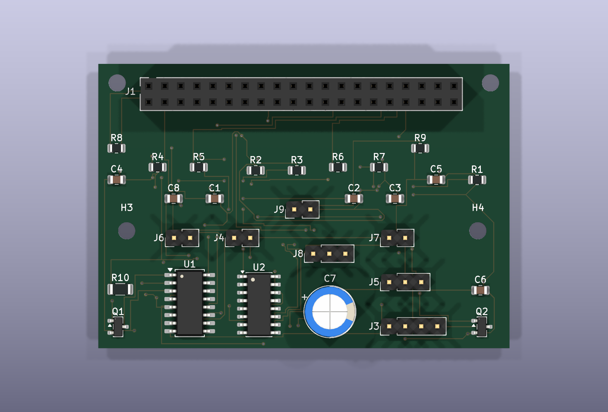
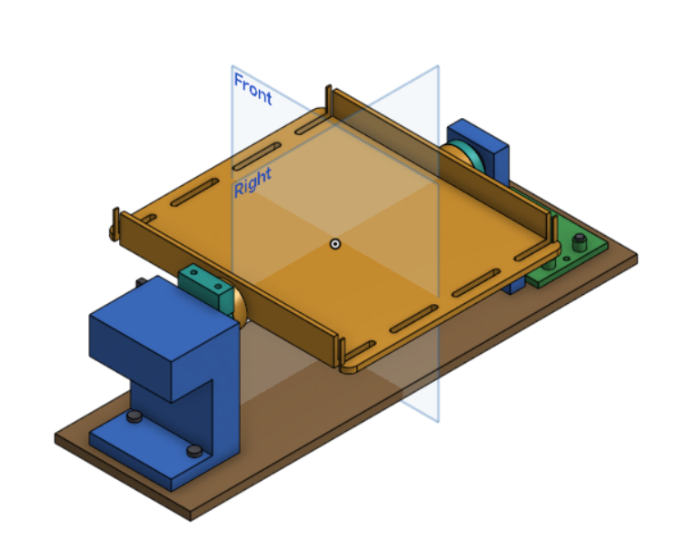

# smartbin

a sorting head that drops into a normal trash can and puts recyclables in the right side by itself.

[](https://kicanvas.org/?repo=https://github.com/DagaVedant/SmartBin/tree/main/PCB)



## what it does

you throw something in. an ir beam notices, the item lands on a tilting pan, a load cell weighs it, an led ring lights it and a camera photographs it. a small neural net on a pi decides what it is, a servo tilts the pan, and the item slides into either the trash side or the recycling side.

## why

- public recycling bins get contaminated really easily
- if enough non-recyclable stuff ends up in one, the facility can reject the whole load, so all of it goes to landfill anyway
- basically every recycling project i've seen is an app that tells *you* which bin to use
- i wanted the bin to just do it, so the person doesn't have to care

## how it works

```
item dropped
   -> ir break-beam triggers
   -> item settles on the pan, load cell reads weight
   -> led ring on, camera captures, led off
   -> classifier returns one of six categories plus a confidence
   -> weight adjusts the result
   -> county rules map the category to a bin
   -> below the confidence threshold it goes to trash
   -> servo tilts, item slides, pan returns level
   -> event written to sqlite, served as json
```

two ideas drive most of the design:

**mistakes aren't symmetric.** a recyclable in the trash costs one recyclable. trash in the recycling can cost a whole load. so every uncertain decision goes to trash, enforced in two places -- a confidence gate at runtime, and a config check that refuses to start if a rules file would ever send an unidentified item to recycling.

**the pi can't sleep between items.** booting takes 20-30 seconds and an item lands in under one, so it stays awake and *idle* power dominates the whole budget. that single fact picks the board -- a zero 2 w idles at about 10 wh/day where a 4b needs about 65.

## the board

65 × 45 mm, 2 layers, 34 components, pi zero hat footprint. mounting holes on the 58 × 23 pattern; the extra 15 mm overhangs the pi.

| block | parts |
|---|---|
| load cell front end | hx711, pass transistor, feedback divider, 4 caps |
| battery sense | mcp3208 12-bit spi adc, divider, filter |
| servo rail | isolated supply, 470 uf bulk, star ground through one 0r link |
| led ring | logic-level mosfet low-side switch |
| break-beam | receiver pull-up, emitter current limit |

- **hx711 runs at 3.3 v, not 5 v.** at 5 v its logic threshold is 3.5 v and a 3.3 v gpio can't reliably hit that. running it at 3.3 v deletes 4 level-shifting parts
- **the two grounds meet at exactly one point.** a stalling servo sharing a return browns out the pi and corrupts the sd card, and it looks exactly like a software bug for hours
- **servo on gpio12, led on gpio13.** deliberately different pwm channels -- gpio12 and gpio18 are both pwm0, so the obvious pairing would've put two things needing independent duty cycles on one timer

fully routed, ground plane poured, **drc clean -- 0 violations, 0 unconnected.** gerbers in `PCB/gerber_drl_files/`.

## the mechanics



7 printed parts, 21 placed instances in the assembly, 180 × 330 × 101 mm envelope.

| part | job |
|---|---|
| `base-plate` | 330 × 100 × 6 mm datum everything bolts to |
| `pan` | the tilting tray the item lands on |
| `pan-hub` | driven side, couples to the servo horn |
| `pan-idler` | free side, rides in the 608zz |
| `servo-mount` | mg996r drops into a captive pocket, shaft on the pivot axis |
| `bearing-block` | carries the 608zz on the idler side |
| `pi-mount` | pi on 6 mm standoffs, 58 × 23 pattern |

- the pivot is held at two points 206 mm apart. the base plate is what keeps them coaxial -- without it the servo's own reaction torque twists them out of line and the pivot binds
- **the pivot sits 70 mm above the plate.** not arbitrary: the pan is 180 mm wide, so at 45° its edges swing 65 mm below the axis. any lower and the pan hits the plate before it finishes tilting
- every part is a single connected solid, every joint measures a 0.00 mm gap, 0 interferences, and the pan clears everything through the full ±45° sweep with 4.9 mm spare
- the servo pocket is built around **my actual mg996r**, not the datasheet -- body measured 39.9 mm not 40.7, shaft 10.95 mm off centre not 10.35

everything around the mechanism -- the bridge carrying the camera, the throat funnel, sensor mounts, chute and enclosure -- isn't modelled yet.

`smartbin-head.step` is the whole thing as one named assembly tree, so it opens in onshape or fusion with every part listed separately. in onshape: **+ → import**, and leave "import as a single part studio" unchecked.

## the classifier

six classes: pet bottle, metal can, clean paper, organics, soiled, unknown. mobilenetv2 with a frozen backbone, exported as int8 tflite because a zero 2 w has 512 mb and no accelerator.

- **the split is by session, not by frame.** frames from one session are near-duplicates -- same lighting, same background, often the same object a few degrees rotated. split those randomly and half your test set is a near-copy of something in training, so the accuracy number is inflated and you don't find out until it's in the bin
- `evaluate.py` prints **both** numbers and the gap between them. the frame-split number is there specifically as the number not to believe
- it also prints recycle precision separately, because that's the one that matters. a recyclable in the trash costs one item. trash in the recycling can cost the whole load

```
python build_manifest.py     scan session folders -> manifest.csv
python train.py              train on the session split
python evaluate.py           honest vs naive accuracy, confusion, recycle precision
python export.py             int8 tflite for the pi
```

three dependencies: tensorflow, numpy, pillow.

## what's in here

| path | contents |
|---|---|
| `CAD/` | 7 parts as step, plus `smartbin-head.step` -- the full assembly |
| `PCB/` | kicad schematic, board and project, gerbers in `gerber_drl_files/` |
| `firmware/` | the code that runs on the pi. sort loop, rules gate, sqlite log, json api |
| `ml/` | classifier training and honest evaluation. never runs on the device |
| `images/` | board renders and the assembly |
| `bill_of_materials.csv` | every part needed to build one |

## where it's at

| thing | status |
|---|---|
| schematic | 34 components, 26 nets, connectivity verified against the netlist |
| board | routed, plane poured, **drc clean** |
| gerbers | exported |
| cad | 7 parts, 0 interferences, pan clears ±45° |
| firmware | 8 modules. trigger, weigh, capture, classify, gate, actuate, log, json api |
| ml pipeline | 6 modules, tensorflow only. manifest, session split, train, evaluate, int8 export |
| classifier | not trained. no dataset collected |

every number above comes from kicad's drc and erc, and from interference and swept-collision checks on the cad.
